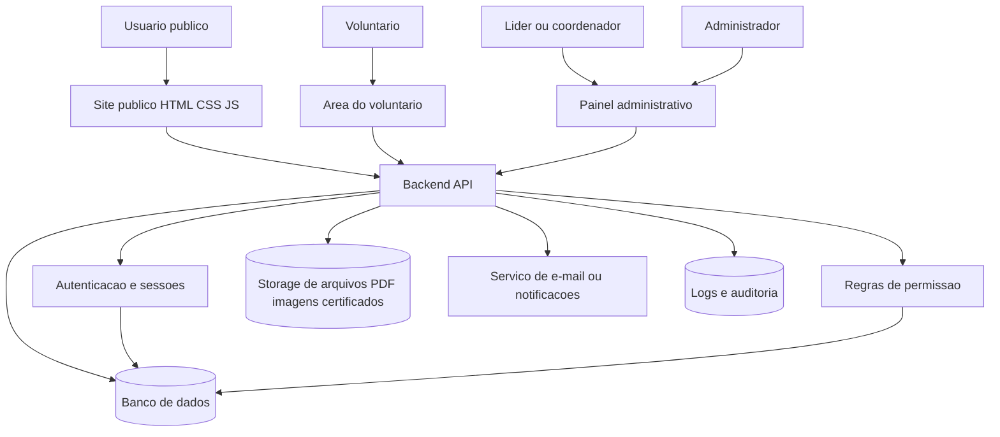
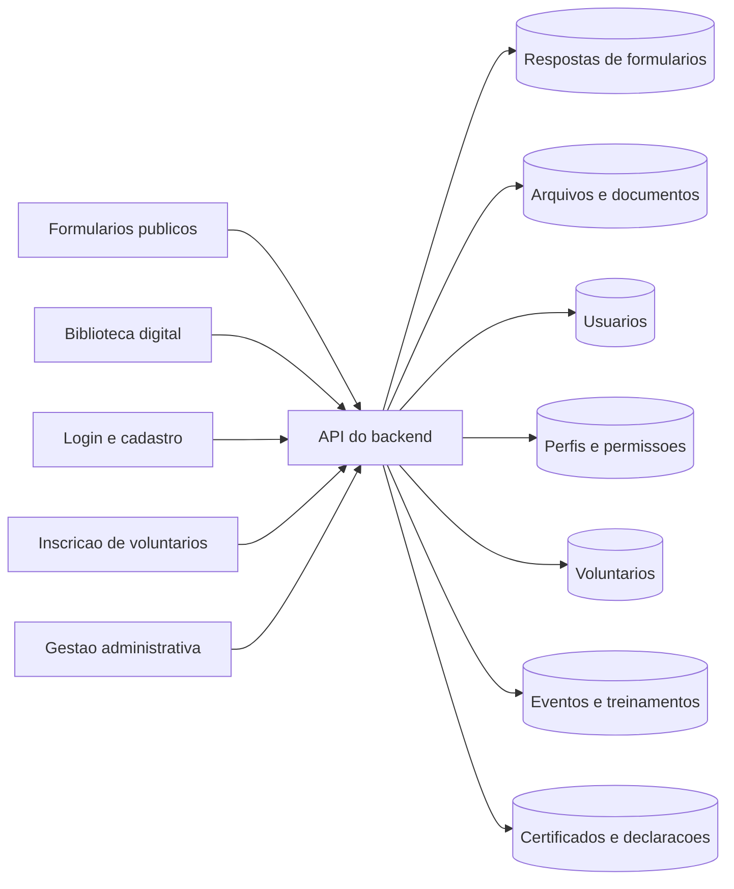
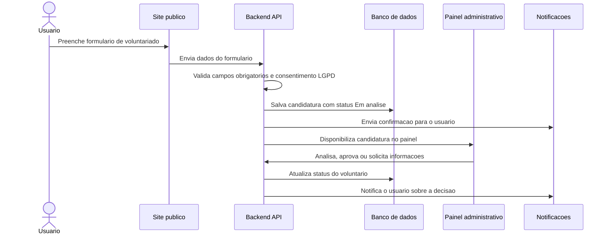
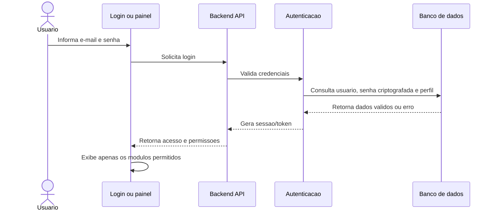
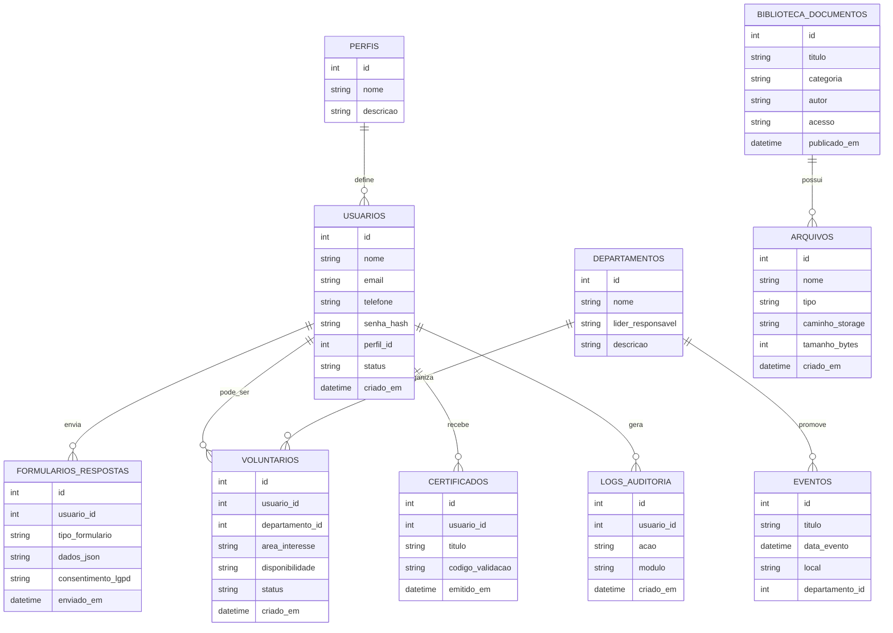

# Diagrama do Backend - Comunidade do Reino

Data: 2026-07-16
Status: Proposta de arquitetura futura
Projeto: Portal institucional, area administrativa e plataforma digital da Comunidade do Reino

## 1. Objetivo

Este documento mostra, em formato de diagrama, como o backend podera funcionar quando o projeto deixar de ser apenas um site estatico/MVP demonstrativo e passar a ter autenticacao real, banco de dados, permissoes, formularios conectados, biblioteca digital e area administrativa funcional.

Tambem foi criado um diagrama visual geral em formato Draw.io: `DIAGRAMA-SISTEMA-GERAL.drawio`. Esse arquivo serve para abrir no diagrams.net/Draw.io e visualizar o funcionamento completo do sistema em blocos.

## 2. Visao geral da arquitetura

## 3. Como cada area se conecta ao backend

## 4. Fluxo de cadastro de voluntario

## 5. Fluxo de login e permissao

## 6. Modelo inicial de dados

## 7. Modulos principais do backend

| Modulo | Funcao |
| --- | --- |
| Autenticacao | Login, logout, recuperacao de senha, sessoes e tokens. |
| Usuarios | Cadastro, edicao, status e dados de acesso. |
| Perfis e permissoes | Controle do que cada perfil pode visualizar, criar, editar ou excluir. |
| Voluntarios | Inscricoes, analise, aprovacao, acompanhamento e historico. |
| Formularios | Recebimento, validacao e consulta das respostas enviadas. |
| Biblioteca | Cadastro de materiais, categorias, PDFs, capas e regras de acesso. |
| Arquivos | Upload, armazenamento, validacao de tamanho e tipo de arquivo. |
| Agenda | Eventos, treinamentos, reunioes e presencas. |
| Certificados | Geracao futura de certificados e declaracoes. |
| Logs e auditoria | Registro de acessos e acoes administrativas importantes. |

## 8. Regras importantes

- O site publico continuara exibindo conteudo institucional.
- Formularios publicos deverao enviar dados para a API.
- A area administrativa so devera abrir para usuarios autenticados.
- Cada perfil devera acessar apenas os dados autorizados.
- Arquivos enviados deverao passar por validacao de tipo e tamanho.
- Dados pessoais deverao seguir regras de LGPD.
- Acoes administrativas importantes deverao gerar logs.
- Certificados e declaracoes poderao ser gerados automaticamente em uma fase futura.

## 9. Tecnologias possiveis

O backend ainda precisa ser definido. Opcoes viaveis para a proxima etapa:

- Supabase: banco PostgreSQL, autenticacao, storage e API integrada.
- Firebase: autenticacao, banco NoSQL, storage e funcoes serverless.
- Node.js com banco relacional: API propria com maior controle tecnico.

Para o MVP, Supabase pode ser uma boa opcao por reunir autenticacao, banco, storage e regras de acesso em uma plataforma unica.

## 10. Resumo do funcionamento futuro

O usuario acessa o site, preenche formularios ou entra na area restrita. O frontend envia as informacoes para a API. A API valida os dados, verifica permissoes, grava no banco, salva arquivos no storage quando necessario, registra logs e retorna respostas para o site ou painel administrativo.

Assim, o projeto evolui de um site estatico demonstrativo para uma plataforma real, com dados persistentes, seguranca, controle de acesso e possibilidade de crescimento por modulos.
